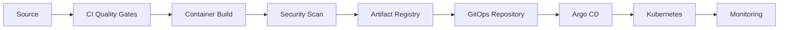

<h1 align="center">Ian Gacheru Kibue</h1>

<h3 align="center">Platform & Infrastructure Engineer | Site Reliability Engineer</h3>

  Building reliable cloud infrastructure, automated delivery pipelines, and production-ready Kubernetes platforms.

  <a href="https://iangk.netlify.app">Portfolio</a> •
  <a href="https://www.linkedin.com/in/ian~kibui">LinkedIn</a> •
  <a href="mailto:gacheruian99@gmail.com">Email</a>

  

---

## About Me

Platform and Infrastructure Engineer with over three years of experience supporting business-critical systems across cloud, on-premises, and data-centre environments.

I work with Kubernetes, GCP, Docker, Terraform, CI/CD, GitOps, Linux, networking, security, and observability. My software engineering background helps me bridge application development and reliable production operations.

## Selected Project

### End-to-End Kubernetes Delivery Platform

A production-focused platform engineering project for securely building, publishing, and deploying a containerized application to Kubernetes.

The platform includes:

* Automated linting, testing, and application builds
* Multi-stage Docker builds with dependency caching
* Container vulnerability scanning before publication
* Immutable image tagging using Git commit identifiers
* Image storage in an OCI-compatible artifact registry
* Kubernetes configuration managed with Helm
* GitOps deployments and drift correction using Argo CD
* ConfigMaps and externally managed application secrets
* Readiness, liveness, and startup health probes
* Resource requests, limits, and multiple application replicas
* Rolling updates with deployment health verification
* Prometheus metrics and Grafana dashboards
* Automated rollback when deployment verification fails

The project demonstrates the complete delivery path from a developer commit to a secure, observable, and recoverable Kubernetes deployment.

---

  <strong>Build reliably. Automate intentionally. Improve continuously.</strong>

