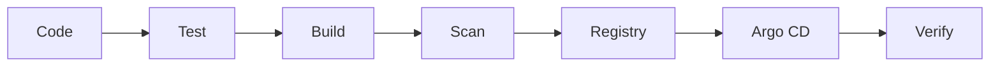

<h1 align="center">Ian Gacheru Kibue</h1>

<h3 align="center">Platform & Infrastructure Engineer | Site Reliability Engineer</h3>

  Building reliable cloud infrastructure, automating deployments, and improving production reliability.

  <a href="https://iangk.netlify.app">Portfolio</a> •
  <a href="https://www.linkedin.com/in/ian~kibui">LinkedIn</a> •
  <a href="mailto:gacheruian99@gmail.com">Email</a>

  

---

## About Me

Platform and Infrastructure Engineer with over three years of experience supporting business-critical systems across cloud, on-premises, and data-centre environments.

I work with Kubernetes, Docker, GCP, Terraform, CI/CD, GitOps, Linux, networking, and observability. My software engineering background helps me understand both how applications are built and what they need to run securely and reliably in production.

## Selected Projects

### Cloud-Native Application Deployment

Containerized and deployed a Next.js application to Kubernetes using multiple replicas, resource limits, health checks, readiness probes, and declarative manifests managed through Argo CD.

### Safe Deployment Pipeline

Building a CI/CD pipeline that:

The workflow builds and scans container images, publishes them to an artifact registry, deploys through GitOps, verifies application health, and supports rollback when a release fails.

---

  <strong>Build reliably. Automate intentionally. Improve continuously.</strong>

